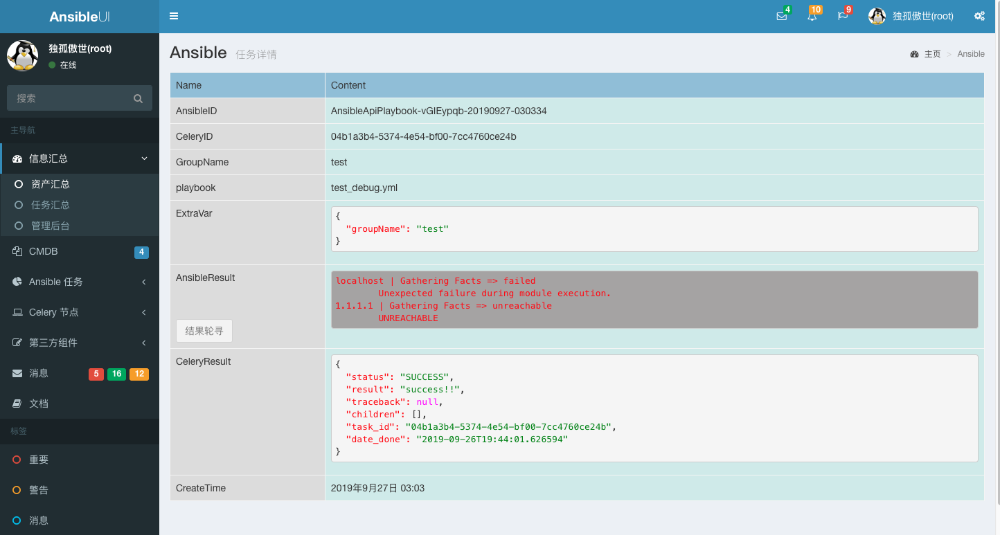

# AnsibleUI

#### 介绍

AnsibleUI 是基于Django + Ansible + Celery 的Web平台，用以批量的任务异步处理

Gitee 地址：https://gitee.com/lwr_dgas/AnsibleUI

#### 软件架构

软件架构说明
*   Ansible使用公私钥登录进行主机操作

**该项目在实验楼上有开发教程，地址为 [https://www.shiyanlou.com/courses/1380](https://www.shiyanlou.com/courses/1380)**

**Demo 地址 [www.ansibleui.cn](http://www.ansibleui.cn:10089) admin:12345678 ， demo 未启动 Celery 进程，请勿添加任务**

#### 安装教程
*   Ansible使用私钥进行登录操作，私钥文件位置：`files/id_rsa`，或者在ansible.cfg中修改
*   Docker集群部署，启动端口 10089
    *   docker-compose build
    *   docker-compose up 
*   手动部署
    *   安装 Python 环境，开发环境版本为 Python 3.7.6
    *   安装相关pagkage `pip3 install -i https://pypi.tuna.tsinghua.edu.cn/simple -r requirements.txt`
    *   配置相关参数 tools/config.py，包括redis、mysql，Ansible/settings.py 文件可修改 DATABASES 使用sqlite3
    *   为数据库建表，`python3 manage.py makemigrations && python3 manage.py migrate`
    *   在代码目录下启动Celery，`celery -A myCelery worker -l info`，可参看myCelery.py文件尾注释部分
    *   启动主服务，`python3 manage.py runserver 0.0.0.0:10089`。
*   服务启动
    * 启动celery，请设置 `export PYTHONOPTIMIZE=1`, 否则 celery 将无法调用 ansible
    * Celery启动，`celery multi start 1 -A myCelery -l info -c4 --pidfile=tmp/celery_%n.pid -f logs/celery.log`
    * 主程序启动，`uwsgi --http 0.0.0.0:10098 --module ansible_ui.wsgi --py-autoreload=1 --static-map=/static=static --daemonize=logs/uwsgi.log`

#### 配置项

tools/config.py
    ansible 远程连接用户
    Redis 存放Celery
    MySQL

#### 使用说明

0. 需外部提供MySQL和Redis，参数在tools/config.py内修改
**QQ群：929411662，群名称：AnsibleUI**

**群二维码**

#### UI 效果图

