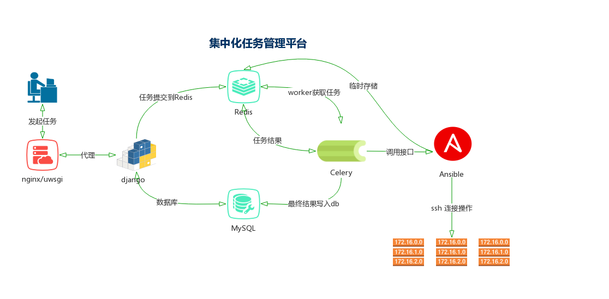
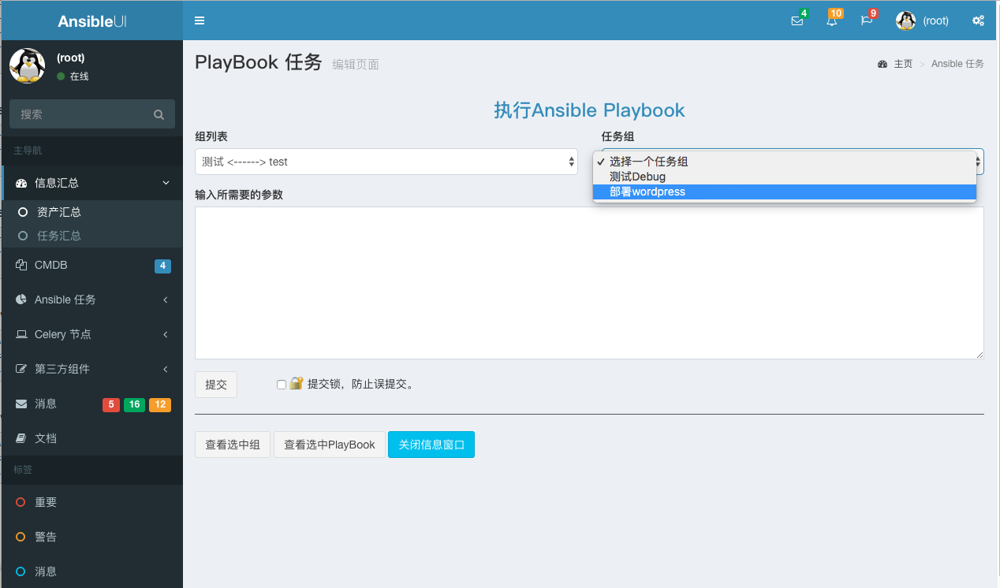
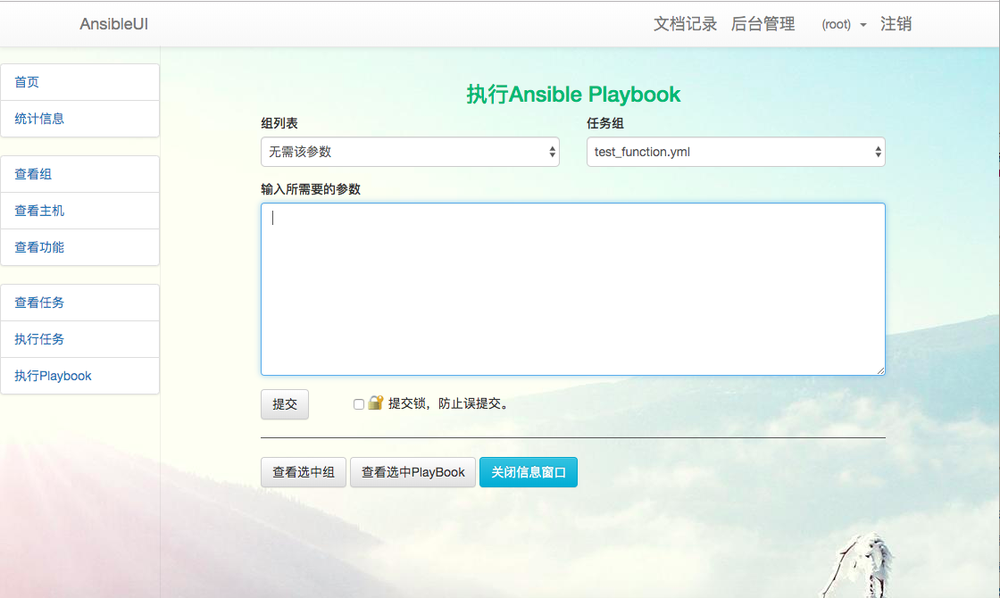
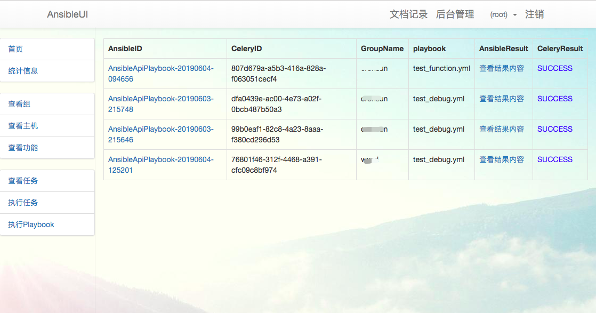
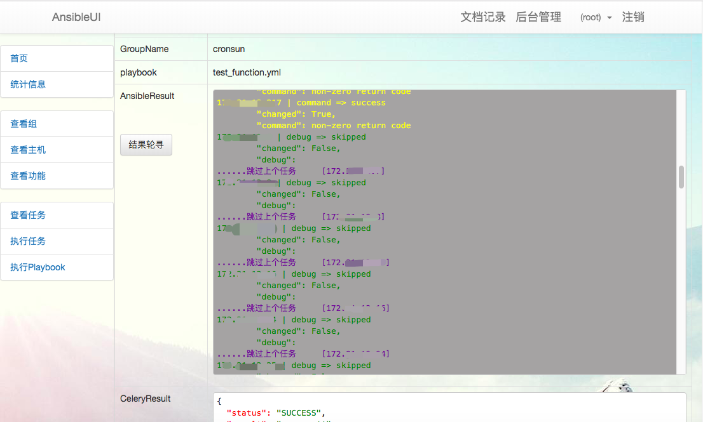
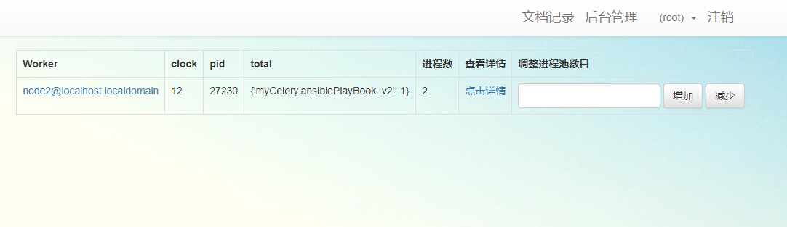

# AnsibleUI

#### 介绍

AnsibleUI 是基于Django + Ansible + Celery 的Web平台，用以批量的任务异步处理

##### 本人最近开始看工作，欢迎推荐和骚扰
* 微信： lwr_dgas
* 邮箱： lwr_dgas@163.com

#### 软件架构

软件架构说明
*   Ansible使用公私钥登录进行主机操作



**该项目在实验楼上有开发教程，地址为 [https://www.shiyanlou.com/courses/1380](https://www.shiyanlou.com/courses/1380)**

**近期内，项目准备重新开发前端页面，使用 AdminLTE 框架**
效果图



#### 安装教程
*   为方便安装，请下载python包到files目录下，https://www.python.org/ftp/python/3.7.3/Python-3.7.3.tgz
*   Ansible使用私钥进行登录操作，私钥文件位置：files/id_rsa，或者在ansible.cfg中修改
*   可直接使用docker部署启动，
    *   在代码目录下 docker build -t ansible_ui .
    *   docker run -it -p 10089:10089 -v `pwd`:/data ansible_ui
*   手动部署
    *   安装 Python 环境，开发环境版本为 Python 3.6.4
    *   安装相关pagkage `pip3 install -i https://pypi.tuna.tsinghua.edu.cn/simple -r requirements.txt`
    *   配置相关参数 config/tools.py，包括redis、mysql，Ansible/settings.py 文件可修改 DATABASES 使用sqlite3
    *   为数据库建表，`python3 manage.py makemigrations && python3 manage.py migrate`
    *   在代码目录下启动Celery，`celery -A myCelery worker -l info`，可参看myCelery.py文件尾注释部分
    *   启动主服务，`python3 manage.py runserver 0.0.0.0:10089`。
*   服务启动
    * 启动Celery，设置`ln -s AnsibleUI ansibleUI`。
    * 启动celery，请设置 `export PYTHONOPTIMIZE=1`, 否则celery将无法调用ansible
    * Celery启动，`celery multi start 1 -A myCelery -l info -c4 --pidfile=tmp/celery_%n.pid -f logs/celery.log`
    * 主程序启动，`uwsgi --socket 127.0.0.1:9801 --module AnsibleUI.wsgi --py-autoreload=1 --daemonize=logs/uwsgi.log`
    * 静态资源及代理，nginx最简配置
    ```conf
        server {
            listen       10086;
            access_log logs/ansibleui.access.log;
            error_log  logs/ansibleui.error.log;
            location / {
                    include uwsgi_params;
                    uwsgi_pass 127.0.0.1:9801;
            }
            location /static {
                root /data/AnsibleUI/;
            }
            location ~ .*\.(gif|jpg|jpeg|png|bmp|swf)$ {
                expires      30d;
            }
        }
    ```

#### 配置项

tools/config.py
    ansible 远程连接用户
    Redis 存放Celery
    MySQL

#### 使用说明

0. 需外部提供MySQl和Redis，参数在tools/config.py内修改

#### UI











